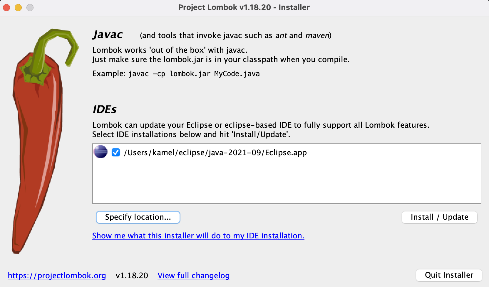

# LAB 1 : Mise en place de la plateforme de développement

## les points à voir

- Préparation de la plateforme
- Dernière mise à jour des outils

## Installation des outils de la plateforme de développement

Installer les dernières versions des outils ci dessous. Tous les binaires sont fournis dans cet atelier.

- OpenJDK 11
- Eclipse, IntelliJ ou Visual Code
- Maven 3.8.2
- Postman
- Docker

## Vérification de la plateforme

Lancer les commandes suivantes et comparer les résultats

```
java -version
```
```
maven --version
```
```
docker -v
```

Si une commande ne fonctionne pas correctement, alors vérifiez que la variable d'environnement en question est bien définie (**JAVA_HOME**, **M2_HOME**, etc.)

## Installation de lombok

Aller à l'adresse du maven central et récuperer la dernière version du **jar** lombok
```
https://search.maven.org/search?q=g:org.projectlombok%20AND%20a:lombok&core=gav
```

Lancer la commande
```
java -jar lombok-1.18.20.jar
```

Lancer l'installation




**Redémarrer Eclipse**

## Outils utilisés dans ce lab
+ [OpenJDK11](https://jdk.java.net/java-se-ri/11)
+ [Maven](https://maven.apache.org/download.cgi)
+ [Docker](https://docs.docker.com/install/)
+ [Postman](https://www.postman.com/downloads/)
+ [Eclipse](https://www.eclipse.org/downloads/)
+ [IntelliJ](https://www.jetbrains.com/fr-fr/idea/download/)
+ [Visual Code](https://code.visualstudio.com/download)
