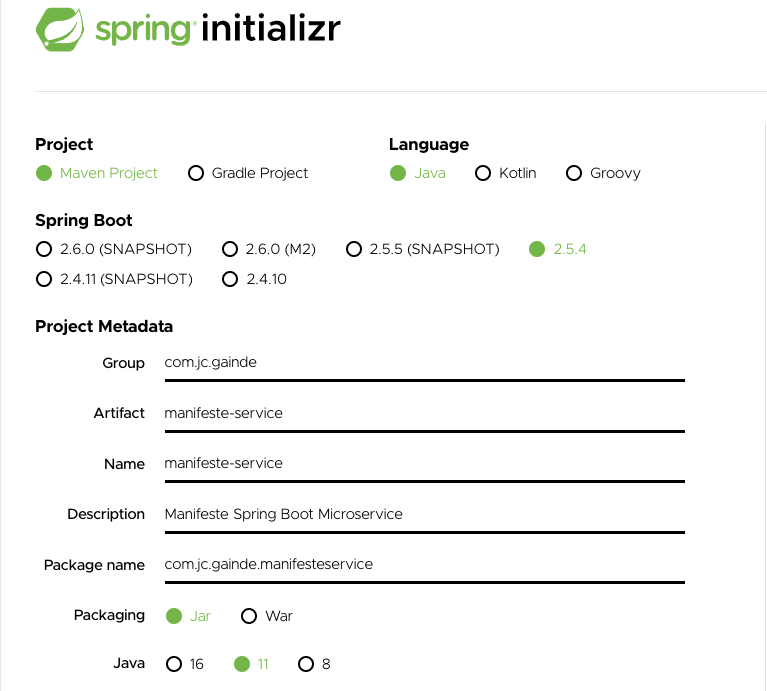
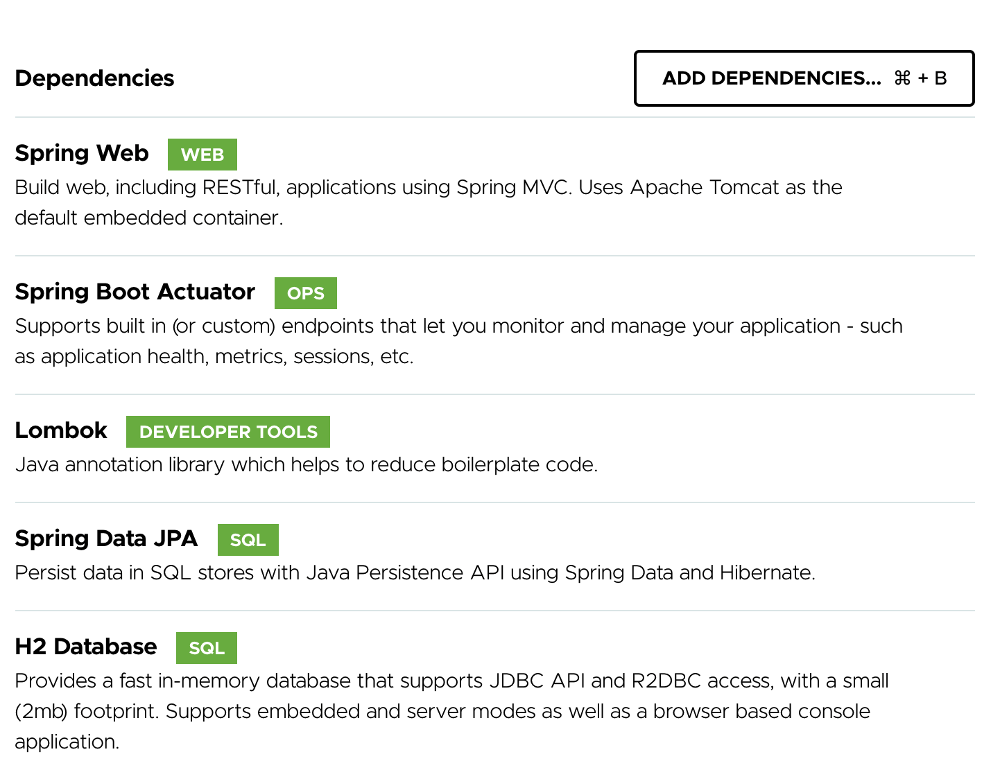
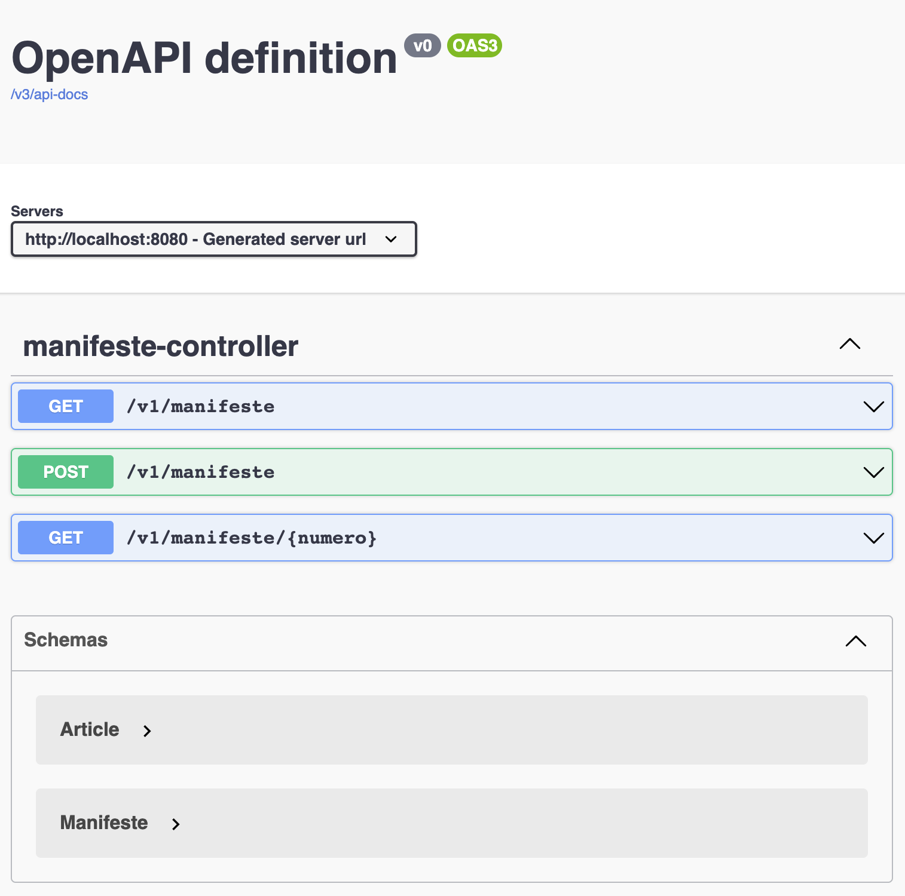

# LAB 2 : Développement d'un premier module Gainde manifeste-service avec Spring Boot

## Objectif

Cet atelier à pour but de créer un premier module Spring Boot pour Gérer les Manifestes douanier en utilisant l'outil fourni par Spring. Le module doit respecter les bonnes pratiques de développement (rest, documentation api, production ready, etc).

## les points à voir

+ Utilisation de sprint Initializr
+ Comprendre la structure d'un projet spring boot
+ Compiler et démarrer un projet Spring boot en ligne de commande
+ Génération d'une interface REST
+ Introduction d'actuator
+ Présentation de Lombok
+ Documentation de l'API

## Initialisation du projet

Il s'agit de générer un projet spring boot en se basant sur un modèle disponible sur Spring Initializr. Pour cela, aller sur [Spring Initializr](https://start.spring.io/) et générer une application en respectant toutes les informations de la capture ci dessous.



## Ajouter les dépendances nécessaire à notre module

Appuyer sur le bonton **Add Dependecies** et selectionner les dependances suivantes



+ Spring Web
+ Actuator
+ Lombok
+ Spring Data JPA
+ H2

NB : Bien comprendre l'utilité de chaqune des dependances.

## Générer le module manifeste-service

Appuyer sur **Generate** pour générer le code source du module avec les différentes personalisations effectués. D'autres actions sont disponibles : **Explore**, **Share**

## Importer le projet dans l'éditeur

Commencer par décompresser l'archive et ensuite importer le projet dans votre éditeur.

Vérifier que le projet compile correctement en passant par l'éditeur. S'il y a des problèmes de compilation alors vérifier que le JDK est bien pris en compte dans l'éditeur.

**Bien comprendre le contenu du fichier pom.xml**

## Définir le nom du module

Dans le fichier application.properties, bien définir l'attribut **spring.application.name**

```
spring.application.name=manifeste-service
```

## Création des entitées du modèle

Créer une nouvelle classe java **Manifeste** dans le package **model** avec le contenu suivant
```
package com.jc.gainde.manifesteservice.model;

import lombok.*;

import javax.persistence.*;
import java.util.Collection;
import java.util.Date;

@Setter
@Getter
@Builder(setterPrefix = "with")
@ToString
@AllArgsConstructor
@NoArgsConstructor
@EqualsAndHashCode
@Entity
public class Manifeste {

    @Id @GeneratedValue
    private Long id;
    private String numeroRepertoire;
    private Date dateArrivee;
    private String bureau;
    private String moyenTransport;
    private String typeManifeste;
    private String statut;
    private int numero;
    private String annee;    
    @OneToMany(fetch = FetchType.EAGER, cascade = CascadeType.ALL)
    private Collection<Article> articles;
}

```

Ajouter une classe Article avec le contenu suivant
```
package com.jc.gainde.manifesteservice.model;

import lombok.*;

import javax.persistence.Entity;
import javax.persistence.GeneratedValue;
import javax.persistence.Id;

@Setter
@Getter
@Builder(setterPrefix = "with")
@ToString
@AllArgsConstructor
@NoArgsConstructor
@EqualsAndHashCode
@Entity
public class Article {

    @Id
    @GeneratedValue
    private Long id;
    private String numero;
    private String titreTransport;
    private int nombreColis;
    private String modeConditionnement;
    private int poidsBrut;
    private String designationCommerciale;
}
```

## Utilisation de JpaRepository pour les accès à la base

Créer une nouvelle interface **ManifesteRepository** qui hérite de JpaRepository et qui prend en paramètres : l'entitée Manifeste et la clé primaire de type Long

```
package com.jc.gainde.manifesteservice.repository;

import com.jc.gainde.manifesteservice.model.Manifeste;
import org.springframework.data.jpa.repository.JpaRepository;

public interface ManifesteRepository extends JpaRepository<Manifeste,Long> {

}
```

## Création du service ManifesteService

Créer une nouvelle classe ManifesteService permettant de définir les opérations à réaliser pour notre modèle (CRUD)

```
package com.jc.gainde.manifesteservice.service;

import com.jc.gainde.manifesteservice.model.Manifeste;
import com.jc.gainde.manifesteservice.repository.ManifesteRepository;
import lombok.extern.slf4j.Slf4j;
import org.springframework.beans.factory.annotation.Autowired;
import org.springframework.stereotype.Service;

import java.util.List;
import java.util.Optional;

@Slf4j
@Service
public class ManifesteService {

    private final ManifesteRepository manifesteRepository;

    @Autowired
    public ManifesteService(ManifesteRepository manifesteRepository) {
        this.manifesteRepository = manifesteRepository;
    }

    public List<Manifeste> getManifestes() {
        log.info("recuperation des manifestes service");
        return manifesteRepository.findAll();
    }

    public Manifeste createManifeste(Manifeste manifeste) {
        log.info("service nouveau manifeste");
        return manifesteRepository.save(manifeste);
    }

    public Optional<Manifeste> findById(Long id) {
        log.info("service get manifeste by id");
        return manifesteRepository.findById(id);
    }
}
```
## Création d'un controlleur ManifesteController

Créer une nouvelle classe ManifesteController permettant d'exposer toutes les opérations du Manifeste

```
package com.jc.gainde.manifesteservice.controller;

import com.jc.gainde.manifesteservice.model.Manifeste;
import com.jc.gainde.manifesteservice.service.ManifesteService;
import lombok.extern.slf4j.Slf4j;
import org.springframework.beans.factory.annotation.Autowired;
import org.springframework.web.bind.annotation.*;

import java.util.List;

@Slf4j
@RestController
@RequestMapping(value="/v1")
public class ManifesteController {

    @Autowired
    ManifesteService manifesteService;

    @GetMapping(value="/manifeste")
    public List<Manifeste> getManifestes() {
        log.info("Récuperation des manifestes");
        return manifesteService.getManifestes();
    }

    @PostMapping(value="/manifeste")
    public void createDManifeste(@RequestBody() Manifeste manifeste) {
        log.info("Création d'un manifeste");
        manifesteService.createManifeste(manifeste);
    }

    @GetMapping(value = "/manifeste/{id}")
    public Manifeste getManifeste(@PathVariable Long id) {
        log.info("Chargement d'un manifeste avec l'id", id);
        return manifesteService.findById(id)
                .orElseThrow(() -> new RuntimeException(String.valueOf(id)));
    }

}
```

## Persistance des donnée

Dans le cadre de ce lab, nous mettrons en place une base de donnée de type H2 en mémoire. Pour cela, ajouter l'élement suivant dans **application.properties** du projet

```
spring.datasource.url=jdbc:h2:mem:testdb
```

## Ajouter la recherche de manifeste par numero de répertoire

Dans **ManifesteRepository** ajouter la méthode suivante :

```
List <Manifeste> findByNumeroRepertoire(String numeroRepertoire);
```

Dans **ManifesteService**
```
public List<Manifeste> getManifesteByNumeroRepertoire(String numero) {
    log.info("service : get manifeste par numero repertoire");
    return manifesteRepository.findByNumeroRepertoire(numero);
}
```

Dans **ManifesteController**
```
@GetMapping(value="/manifeste/repertoire/{numero}")
public List<Manifeste> getManifesteByNumero(@PathVariable("numero") String numero) {
    log.info("Récuperation des manifestes par numero");
    return manifesteService.getManifesteByNumeroRepertoire(numero);
}
```

Bien comprendre le fonctionnement par introspection

## Autre exercice : Ajouter la recherche par statut et par date arrivée


Collection <Manifeste> findByStatut(String statut);
Collection <Manifeste> findByStatutAndDateArriveeBetween(String statut, Date dateDebut, Date dateFin);


## Compilation du module en ligne de commande

Lancer la commande suivante pour compiler le projet
```
mvn clean install -DskipTests
```

Analyser le contenu fu fichier générer

## Demarrage du module

Lancer la commande suivante pour démarrer le module
```
mvn spring-boot:run
```

## Modification du port d'écoute du module

Dans le fichier application.properties, rajouter la ligne suivante :

```
server.port=8080
```

## Tests des différents endpoints du manifeste-service

Utiliser Postman pour intéragir avec le module : manifeste-service.

Les URLs de l'application sont à définir

### Création d'un nouveau manifeste avec REST

Realiser une opération HTTP de type POST à l'aide de Postman pour créer un nouveau manifeste. Voici les données d'exemple.

http://localhost:8080/v1/manifeste

```
{
  "numeroRepertoire": "rep1",
  "dateArrivee": "2021-09-13T12:46:26.279Z",
  "bureau": "99z",
  "moyenTransport": "aerien",
  "typeManifeste": "maritime",
  "statut": "brouillon",
  "numero": 1
}
```

La réponse HTTP doit être 200 OK

## Mise en place de Spring Boot Actuator

Dans le fichier properties rajouter les propriétés suivantes :

```
management.endpoints.web.exposure.include=*
info.app.version=1.0
```

Les URL d'actuator sont :
```
http://localhost:8080/actuator
http://localhost:8080/actuator/info
http://localhost:8080/actuator/health
```

Exercice : définir les attributs auteur et date release pour le module manifeste-service dans /info

## Documentation du module avec Openapi

Afin de documenter proprement l'API du module manifeste-service nous mettrons en place la bibliothèque springdoc-openapi. Pour cela, rajouter dans le pom.xml, la dépendance suivante :
```
<dependency>
  <groupId>org.springdoc</groupId>
  <artifactId>springdoc-openapi-ui</artifactId>
  <version>1.5.10</version>
</dependency>
```

Bien vérifier qu'il s'agit de la dernière version de l'éditeur

### Tests des urls Openapi

Pour voir la description de l'api du module, lancer la commande suivante :
```
http://localhost:8080/v3/api-docs/
```

Pour accéder à l'interface Swagger UI, utiliser l'url suivante :
```
http://localhost:8080/swagger-ui.html
```




PS : Bien analyser le résultat de Swagger UI

## Exercice facultatif

Remplacer la base mémoire H2 par une base de type PostgreSQL

## Pour résumer

- Spring Initializr pour la génération du module de projet
- Spring boot pour le developpement du module
- Spring boot Actuator pour les concepts de production ready
- Spring Data JPA pour l'accès aux donnée
- Springdoc openapi pour la documentation de l'API
