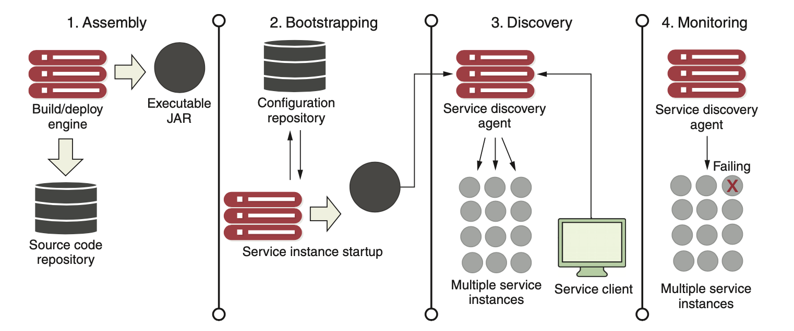

# LAB 3 : Centralisation de la configuration de Gainde avec Spring Cloud Config

## Objectif

Cet atelier à pour but d'externaliser la configuration du module dans un endroit exterieur. Cela facilite le versionning grace au gestionnaire de source et permet de découpler le code source des propriétés de chaque module. Ce pattern facilite aussi la gestion des environnements. Un seul code source pour le module et divers properties par environnement (dev, recette, production)

## les points à voir

+ Utilisation de Spring Cloud Config Client
+ Utilisation de Spring Cloud Config Server
+ Pattern de développement : Externalized Configuration

## Initialisation du projet config-service

Il s'agit de générer un projet spring boot en se basant sur un modèle disponible sur Spring Initializr. Pour cela, aller sur [Spring Initializr](https://start.spring.io/) et générer une application en respectant toutes les informations ci dessous.

| Element | Valeur |
|--------|---------------|
| Project|  Maven Project |
| Language | Java |
|Spring Boot| 2.5.5|
|GroupID| com.jc.gainde|
|Artifact|config-service|
|Name|config-service|
|Description|Configuration Spring Boot Server|
|Package name|com.jc.gainde.configservice|
|Packaging|Jar|
|Java|11|

**Dependencies**

Ajouter Config Server dans la zone Dependencies
```
Config Server
```

Generer config-service en appuyant sur le bouton **GENERATE** ensuite décompresser l'archive et importer le projet dans l'éditeur de code.

## Definir le port d'ecoute

Dans le fichier **application.properties** du projet, ajouter l'entrée
```
server.port=8888
```

## Définir le nom du service

Toujours dans le même fichier, ajouter l'entrée suivante
```
spring.application.name=config-service
```

## Activation du serveur de configuration

Aller dans la classe main et ajouter l'annotation **@EnableConfigServer**
Cette annotation fait partie du package :
```
import org.springframework.cloud.config.server.EnableConfigServer;
```

## Paramétrage du serveur de configuration

Ajouter l'attribut suivant dans **application.properties**
```
spring.cloud.config.server.git.uri=https://github.com/kamel2k/application-config.git
```

Pour un accès local : file:///${user.home}/application-config

## Compilation du projet

A l'aide de l'invite de commande, taper la commande
```
mvn clean install -DskipTests
```

## Exécution du serveur de configuration

Pour lancer le serveur de configuration, utiliser la commande
```
mvn spring-boot:run
```

Vérifier dans les logs de démarrage que le service **config-service** démarre correctement et écoute sur le port **8888**

```
2021-09-15 00:00:15.084  INFO 63407 --- [           main] o.s.b.w.embedded.tomcat.TomcatWebServer  : Tomcat initialized with port(s): 8888 (http)
2021-09-15 00:00:15.094  INFO 63407 --- [           main] o.apache.catalina.core.StandardService   : Starting service [Tomcat]
2021-09-15 00:00:15.094  INFO 63407 --- [           main] org.apache.catalina.core.StandardEngine  : Starting Servlet engine: [Apache Tomcat/9.0.52]
```

## Vérification des ressources disponibles par config-service

Pour externaliser la configuration du module manifestye-service, on vérifie tout d'abord que le serveur de configuration répond correctement avec le fichier de configuration du manifeste

Lancer l'url suivante
```
http://localhost:8888/manifeste-service/dev
```

**dev** : représente le profil spring (environnement de developpement)

la réponse doit être similaire à ça
```
{
   "name":"manifeste-service",
   "profiles":[
      "dev"
   ],
   "label":null,
   "version":"0073e1dfb1cf3d9d449d8d12f3b684078ca433c5",
   "state":null,
   "propertySources":[
      {
         "name":"https://github.com/kamel2k/application-config.git/manifeste-service-dev.properties",
         "source":{
            "server.port":"8080",
            "spring.datasource.url":"jdbc:h2:mem:testdb",
            "spring.application.name":"manifeste-service",
            "management.endpoints.web.exposure.include":"*",
            "info.app.version":"1.0"
         }
      }
   ]
}
```

## Architecture de la gestion de configuration

Voici le cycle de vie d'un module. Le même mécanisme d'applique à tous les modules de **GAINDE**



Bien comprendre les étapes du schéma

## Externalisation de la configuration de manifeste-service

Remplacer le contenu du fichier **application.properties** du module **manifeste-service** dans **/src/main/ressources/** du projet avec ça :

```
spring.config.import=configserver:http://localhost:8888
spring.application.name=manifeste-service
spring.profiles.active=dev
```

## Activation de spring cloud config pour les clients

Dans notre cas, le client du **config-service** est l'application **manifeste-service**. Pour cela rajouter la dependance : **Config Client** de **SPRING CLOUD CONFIG**.
Cette dépendance n'est pas dans la liste initiale des dépendances du projet **manifeste-service**, pour cela voici la mise à jour à faire manuellement dans le **pom.xml** du manifeste

```
<properties>
  <spring-cloud.version>2020.0.4</spring-cloud.version>
</properties>
```
```
<dependencies>
  <dependency>
    <groupId>org.springframework.cloud</groupId>
    <artifactId>spring-cloud-starter-config</artifactId>
  </dependency>
...
</dependencies>  
```
```
<dependencyManagement>
  <dependencies>
    <dependency>
      <groupId>org.springframework.cloud</groupId>
      <artifactId>spring-cloud-dependencies</artifactId>
      <version>${spring-cloud.version}</version>
      <type>pom</type>
      <scope>import</scope>
    </dependency>
  </dependencies>
</dependencyManagement>
```

NB: Spring Initializr permet d'éviter l'ajout manuellement de tous les blocs dans pom.xml

## Ordre de démarrage des services

Puisque le module **manifeste-service** récupère sa configuration auprès du serveur **config-service**, alors l'application **config-service** doit démarrer la première

Démarrer les deux modules et analyser les logs des deux serveur


## Pour résumer

- Spring Cloud Config Server : pour le serveur de Configuration
- Spring Cloud config client doit être défini pour tous les modules
