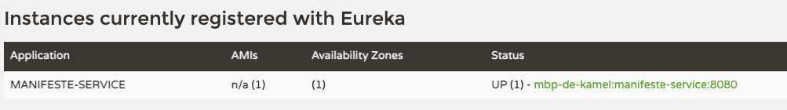

# LAB 4 : Enregistrement et découverte de modules Gainde avec Spring Cloud Discovery

## Objectif

Cet atelier à pour but de configurer un registre de service avec Netflix Eureka, ensuite le module manifeste-service s'enregistre auprès d'Eureka. Le registre de services est utile car il permet l'équilibrage de charge côté client et dissocie les fournisseurs de services des consommateurs sans avoir besoin de DNS.

## les points à voir

+ Utilisation de Spring Cloud Discovery Client
+ Utilisation de Spring Cloud Discovery Server
+ Patterns de développement : Service Discovery et Service Registry

## Initialisation du projet discovery-service

Il s'agit de générer un projet spring boot en se basant sur un modèle disponible sur Spring Initializr. Pour cela, aller sur [Spring Initializr](https://start.spring.io/) et générer une application en respectant toutes les informations ci dessous.

| Element | Valeur |
|--------|---------------|
| Project|  Maven Project |
| Language | Java |
|Spring Boot| 2.5.5|
|GroupID| com.jc.gainde|
|Artifact|discovery-service|
|Name|discovery-service|
|Description|Eureka Service Registration and Discovery Server|
|Package name|com.jc.gainde.discoveryservice|
|Packaging|Jar|
|Java|11|

**Dependencies**

Ajouter Config Server dans la zone Dependencies
```
Eureka Server
Config Client
```

Generer **disovery-service** en appuyant sur le bouton **GENERATE** ensuite décompresser l'archive et importer le projet dans l'éditeur de code.

## Paramétrage d'Eureka (discovery-service)

Dans le fichier **application.properties** du projet **discovery-service** sous **/src/main/ressources**, mettre le contenu suivant

```
spring.config.import=configserver:http://localhost:8888
spring.application.name=discovery-service
spring.profiles.active=dev
```

## Activation du Serveur Eureka

Aller dans la classe main et ajouter l'annotation **@EnableEurekaServer**
Cette annotation fait partie du package :
```
import org.springframework.cloud.netflix.eureka.server.EnableEurekaServer;
```

## Vérification de la configuration d'Eureka

Aller à l'url suivante pour voir si la configuration du **discovery-service** est disponible à travers le **config-service**

```
http://localhost:8888/discovery-service/dev
```
**dev** représente l'environnement cible.

**détails et explications**

```
server.port=8070
spring.application.name=discovery-service
eureka.instance.hostname=localhost
eureka.server.waitTimeInMsWhenSyncEmpty=5
eureka.client.fetchRegistry=false
eureka.client.registerWithEureka=false
eureka.client.serviceUrl.defaultZone=http://${eureka.instance.hostname}:${server.port}/eureka/
```

## Compilation du projet

A l'aide de l'invite de commande, taper la commande
```
mvn clean install -DskipTests
```

## Exécution du serveur de configuration

Pour lancer le serveur de configuration, utiliser la commande
```
mvn spring-boot:run
```

Vérifier dans les logs de démarrage que le service **discovery-service** démarre correctement et écoute sur le port **8070**

```
2021-09-16 09:42:38.143  INFO 76600 --- [           main] o.s.b.w.embedded.tomcat.TomcatWebServer  : Tomcat started on port(s): 8070 (http) with context path ''
2021-09-16 09:42:38.143  INFO 76600 --- [           main] .s.c.n.e.s.EurekaAutoServiceRegistration : Updating port to 8070
2021-09-16 09:42:38.162  INFO 76600 --- [           main] c.j.g.d.DiscoveryServiceApplication      : Started DiscoveryServiceApplication in 2.862 seconds (JVM running for 3.147)
```

## Interface de visualisation d'Eureka

Pour visualiser les modules qui sont enregistrés dans Eureka, lancer l'url suivante
```
http://localhost:8070/
```

NB: Pour l'instant la liste des modules enregistrés est vide dans Eureka.

## Paramétrage du module manifeste pour qu'il s'enregistre auprès d'Eureka

Discovery-service est un annuaire de service, les modules s'enregistrent et peuvent communiquer entre eux.

Pour enregistrer un module/module dans Eureka, il suffit de configurer **Eureka Client** dans chaque module (dans notre cas manifeste-service).

Dans le **pom.xml** du **manifeste-service** rajouter la dépendance suivante
```
<dependency>
  <groupId>org.springframework.cloud</groupId>
  <artifactId>spring-cloud-starter-netflix-eureka-client</artifactId>
</dependency>
<dependency>
  <groupId>javax.inject</groupId>
  <artifactId>javax.inject</artifactId>
  <version>1</version>
</dependency>
```

Redémarrer le **manifeste-service**.

Aller sur la console d'Eureka et voir le résultat d'enregistrement du module **manifeste-service**



## Scale UP du module manifeste-service

Dans un nouveau terminal et dans le dossier **manifeste-service**, lancer une nouvelle instance du module en tapant la commande suivante
```
mvn spring-boot:run -Dspring-boot.run.arguments=--server.port=8181
```

Voir le résultat dans Eureka

#### Exercice

Lancer une 3eme instance du manifeste.

## Appels entre modules

Dans ce chapitre nous allons voir comment deux modules peuvent communiquer entre eux. Un deuxieme module **declaration-service** est déjà prêt dans le dossier **lab4/initial/**. Ce module est développé de la même manière que celui du **manifeste-service**. Le projet est opérationnel. Sachant que toutes les opérations de développement du module sont dans le lab2.

Fonctionnellement, lors du stockage de la déclaration, on réalise l'apurement des titres qui fait référence à un manifeste.

Techniquement, pour la réalisation de ce sénario, le module **declaration-service** doit faire un appel au module **manifeste-service** pour récuperer un manifeste par son id.

### Analyse du projet declaration-service (sources et pom.xml)

Analyser la structure du projet **declaration-service**

Voir les élements présent dans le **pom.xml**

Voir les informations concernant le module **declaration-service** au niveau du serveur de configuration **config-service**
```
http://localhost:8888/declaration-service/dev
```

lancer le projet **declaration-service** et voir les endpoints disponibles avec swagger UI

**Retrouver l'url de l'api du module declaration-service et analyser les endpoints disponibles.**

### Implémentation des methodes d'appels entre module

- Au niveau de la classe **DeclarationServiceApplication** du module **declaration-service**, ajouter l'annotation **@EnableDiscoveryClient**

- ajouter la methode **getRestTemplate** dans **DeclarationServiceApplication**
```
@LoadBalanced
@Bean
public RestTemplate getRestTemplate() {
  return new RestTemplate();
}
```

- Ajouter la methode **searchManifeste** dans **DeclarationController**. Cette méthode permet de faire la recherche  par id manifeste
```
@GetMapping(value="/declaration/manifeste")
public Manifeste searchManifeste(@RequestParam Long id) {
    log.info("Recherche Manifeste");
    return declarationService.getManifeste(id);
}
```

- Dans la classe du service **DeclarationService** injecter le bean **restTemplate** avec
```
    @Autowired
    RestTemplate restTemplate;
```

- Implementer la methode **getManifeste** dans **DeclarationService** en utilisant restTemplate
```
public Manifeste getManifeste(Long id) {
    ResponseEntity<Manifeste> restExchange =
            restTemplate.exchange(
                    "http://manifeste-service/v1/manifeste/{id}",
                    HttpMethod.GET, null,
                    Manifeste.class, id);
    return restExchange.getBody();
}
```

- Redemarrer le module **declaration-controller** et faites quelques tests avec **Swagger UI**
```
http://localhost:9090/v1/declaration/manifeste?id=1
```

Autre test à faire avec un appel entre déclaration et plusieurs instances de manifeste


## Pour résumer

- Spring Cloud Discovery pour la decouverte de service
- Eureka discovery client à définir pour tous les modules
- Appel entre module en utilisant le loadbalanceur
