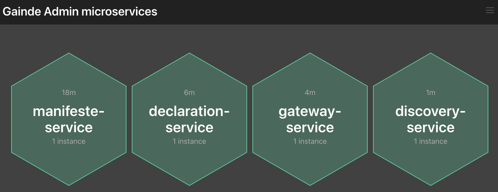

# LAB 6 : Monitoring des modules Gainde avec Spring Boot Admin

## Objectif

Spring Boot Admin à pour but la visualisation des métriques des composants Spring Boot à savoir tous les modules développés jusqu'à présent.

## les points à voir

+ Utilisation de Spring Boot Admin Server
+ Intégration avec Spring Boot Admin Client
+ Intégration avec Spring Cloud Config
+ Pattern de développement : Application metrics

## Initialisation du projet admin-service

Il s'agit de générer un projet spring boot en se basant sur un modèle disponible sur Spring Initializr. Pour cela, aller sur [Spring Initializr](https://start.spring.io/) et générer une application en respectant toutes les informations ci dessous.

| Element | Valeur |
|--------|---------------|
| Project|  Maven Project |
| Language | Java |
|Spring Boot| 2.5.5|
|GroupID| com.jc.gainde|
|Artifact|admin-service|
|Name|admin-service|
|Description|Admin Service|
|Package name|com.jc.gainde.adminservice|
|Packaging|Jar|
|Java|11|

**Dependencies**

Ajouter Config Server dans la zone Dependencies
```
Config Client
Boot Admin Server
Actuator
```

Generer **admin-service** en appuyant sur le bouton **GENERATE** ensuite décompresser l'archive et importer le projet dans l'éditeur de code.

## Activation de Boot Admin

Au niveau de la classe **AdminServiceApplication**, ajouter l'annotation **@EnableAdminServer** cela permet d'activer un serveur Boot Admin

## Intégration avec config-service

Dans le fichier **application.properties** rajouter les élements suivant
```
spring.config.import=configserver:http://localhost:8888
spring.application.name=admin-service
spring.profiles.active=dev
```
## Vérification de la disponibilité des fichiers de configuration

Aller à l'url suivante pour voir si la configuration du **admin-service** est disponible à travers le **config-service**

```
http://localhost:8888/admin-service/dev
```
**dev** représente l'environnement cible.

**détails et explications**

```
server.port=9105
spring.application.name=admin-service

spring.boot.admin.ui.title=Gainde Admin modules
spring.boot.admin.ui.brand=Gainde Admin modules
spring.boot.admin.discovery.converter.management-context-path=/actuator

info.app.version=1.0
```

## Compilation du projet

A l'aide de l'invite de commande, taper la commande
```
mvn clean install -DskipTests
```

## Lancement du service Boot Admin

Pour lancer le service **admin-service**, utiliser la commande
```
mvn spring-boot:run
```

Vérifier dans les logs de démarrage que le service **admin-service** démarre correctement et écoute sur le port **9105**


## Enregistrement des modules dans Boot Admin

Voici l'url d'accès à l'interface d'administration de Boot Admin
```
http://localhost:9105/
```

Aucune application n'est enregistrée pour le moment.

## Enregistrement du manifeste-service dans Boot Admin

Il suffit de rajouter dans le **pom.xml** du **manifeste-service** la dependance du client boot admin

Dans **Dependencies**
```
<dependency>
  <groupId>de.codecentric</groupId>
  <artifactId>spring-boot-admin-starter-client</artifactId>
</dependency>
```

Dans **DependencyManagement/Dependencies**
```
<dependency>
  <groupId>de.codecentric</groupId>
  <artifactId>spring-boot-admin-dependencies</artifactId>
  <version>${spring-boot-admin.version}</version>
  <type>pom</type>
  <scope>import</scope>
</dependency>
```

Dans **properties**
```
<spring-boot-admin.version>2.4.3</spring-boot-admin.version>
```

**Vérification des propriétés de boot admin dans manifeste-service**

Aller à l'adresse http://localhost:8888/manifeste-service/dev pour voir la configuration du module manifeste-service.

Analyser les attributs concernant **boot admin**

```
# boot admin
spring.boot.admin.client.instance.name=manifeste-service
spring.boot.admin.client.url=http://localhost:9105
```

Redémarrer le module **manifeste-service** et voir le résultat dans le dashboard de **admin-service**

**Analyser le contenu du dashboard**

## Intégration de tous les modules avec Boot Admin

De la même manière que **manifeste-service**, refaire les mêmes étapes avec les modules suivants :
+ declaration-service
+ gateway-service
+ discovery-service

Le résultat doit être similaire à celui là



## Ordre de démarrage de tous les modules

+ config-service
+ admin-service
+ discovery-service
+ manifeste-service
+ declaration-service
+ gateway-service

## Pour résumer

+ Monitoring des modules Gainde avec Spring Boot Admin Server
+ Intégration avec Spring Boot admin client pour chaque module
+ Actuator pour l'exposition des métriques nécessaires au dashboard boot admin
+ Intégration avec Spring Cloud Config pour l'externalisation de la configuration
