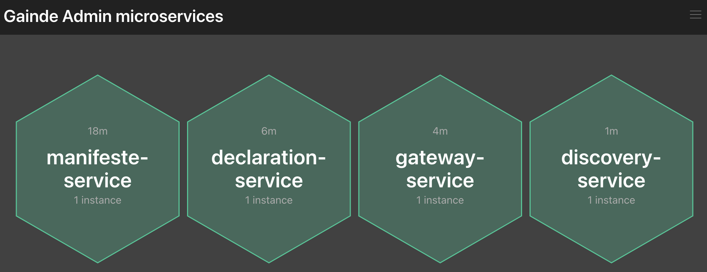

# LAB 7 : Containerisation des modules de Gainde

## Objectif

Pour facilité la portabilité de l'application Gainde, l'utilisation de docker est nécessaire. Docker permet aussi l'isolation de chaque module

## les points à voir

+ Docker pour la containerisation
+ Docker compose pour l'orchestration
+ Pattern de développement : Service instance per Container

## Dockerisation du module manifeste-service

1. A la racine du projet, créer un fichier **Dockerfile** avec le contenu suivant

```
FROM maven:3.6.3-openjdk-11 AS MAVEN_ENV
WORKDIR /build/
COPY pom.xml /build
COPY src /build/src
RUN mvn clean package -DskipTests=true

FROM openjdk:11-jre
COPY  --from=MAVEN_ENV /build/target/*.jar app.jar
#ARG JAR_FILE=target/*.jar
#COPY ${JAR_FILE} app.jar
ENTRYPOINT ["sh", "-c", "java ${JAVA_OPTS} -jar /app.jar"]
```

Bien comprendre les instructions du **Dockerfile**

2. Sous l'invite de commande au niveau du dossier **manifeste-service**, lancer la commande suivante

```
docker build -t gainde/manifeste-service .
```

Pour voir si l'image est crée proprement

```
docker images
```

## Dockerisation de tous les modules

Refaire les mêmes étapes de dockerisation pour les projets suivant
+ declaration-service
+ gateway-service
+ config-service
+ discovery-service
+ admin-service


## Scaler le module manifeste-service avec compose


Il s'agit de générer un projet spring boot en se basant sur un modèle disponible sur Spring Initializr. Pour cela, aller sur [Spring Initializr](https://start.spring.io/) et générer une application en respectant toutes les informations ci dessous.

| Element | Valeur |
|--------|---------------|
| Project|  Maven Project |
| Language | Java |
|Spring Boot| 2.5.4|
|GroupID| com.jc.gainde|
|Artifact|admin-service|
|Name|admin-service|
|Description|Admin Service|
|Package name|com.jc.gainde.adminservice|
|Packaging|Jar|
|Java|11|

**Dependencies**

Ajouter Config Server dans la zone Dependencies
```
Config Client
Boot Admin Server
Actuator
```

Generer **admin-service** en appuyant sur le bouton **GENERATE** ensuite décompresser l'archive et importer le projet dans l'éditeur de code.

## Activation de Boot Admin

Au niveau de la classe **AdminServiceApplication**, ajouter l'annotation **@EnableAdminServer** cela permet d'activer un serveur Boot Admin

## Intégration avec config-service

Dans le fichier **application.properties** rajouter les élements suivant
```
spring.config.import=configserver:http://localhost:8888
spring.application.name=admin-service
spring.profiles.active=dev
```

## Fichier de configuration de boot admin

Créer un fichier dans **home/application-config** sous le nom de **admin-service-dev.properties** avec le contenu suivant

```
server.port=9105
spring.application.name=admin-service

#Overide name ui app
spring.boot.admin.ui.title=Gainde Admin modules
spring.boot.admin.ui.brand=Gainde Admin modules

# rajout de quelques infos concernant actuator
spring.boot.admin.discovery.converter.management-context-path=/actuator

info.app.version=1.0
```


## Compilation du projet

A l'aide de l'invite de commande, taper la commande
```
mvn clean install -DskipTests
```

## Lancement du service Boot Admin

Pour lancer le service **admin-service**, utiliser la commande
```
mvn spring-boot:run
```

Vérifier dans les logs de démarrage que le service **admin-service** démarre correctement et écoute sur le port **9105**


## Enregistrement des modules dans Boot Admin

Voici l'url d'accès à l'interface d'administration de Boot Admin
```
http://localhost:9105/
```

Aucune application n'est enregistrée pour le moment.

## Enregistrement du manifeste-service dans Boot Admin

Il suffit de rajouter dans le **pom.xml** du **manifeste-service** la dependance du client boot admin

Dans **Dependencies**
```
<dependency>
  <groupId>de.codecentric</groupId>
  <artifactId>spring-boot-admin-starter-client</artifactId>
</dependency>
```

Dans **DependencyManagement/Dependencies**
```
<dependency>
  <groupId>de.codecentric</groupId>
  <artifactId>spring-boot-admin-dependencies</artifactId>
  <version>${spring-boot-admin.version}</version>
  <type>pom</type>
  <scope>import</scope>
</dependency>
```

Dans **properties**
```
<spring-boot-admin.version>2.4.3</spring-boot-admin.version>
```

**Mise à jour du fichier de configuration manifeste-service-dev.properties**

Dans **home/application-config/manifeste-service-dev.properties** rajouter les propriétés de spring boot admin (url du serveur et nom de l'application)

```
# boot admin
spring.boot.admin.client.instance.name=manifeste-service
spring.boot.admin.client.url=http://localhost:9105
```

Démarrer le module **manifeste-service** et voir le résultat dans le dashboard de **admin-service**

Analyser le contenu du dashboard

## Intégration de tous les modules avec Boot Admin

De la même manière que **manifeste-service**, refaire les mêmes étapes avec les modules suivants :
+ declaration-service
+ *********gateway-service
+ discovery-service

Le résultat doit être similaire à celui là



## Ordre de démarrage de tous les modules

+ config-service
+ admin-service
+ discovery-service
+ manifeste-service
+ declaration-service
+ gateway-service

## Pour résumer

+ Monitoring des module avec Spring Boot Admin Server
+ Intégration avec Spring Boot admin client pour chaque module
+ Actuator pour l'exposition des métriques nécessaires au dashboard boot admin
+ Intégration avec Spring Cloud Config pour l'externalisation de la configuration
