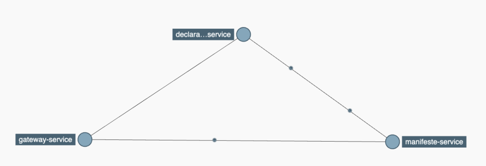

# LAB 8 : Traçage distribué avec Spring Cloud Sleuth

## Objectif

Lorsque une requete arrive au systeme, elle passe par pliusieurs modules. Chaque module loggue un ensemble de lignes de traitement.
Les logs de chaque module sont répartis dans des endroits différents.
Spring Cloud Sleuth permet de rajouter un identifiant de correlation pour chaque module et avec l'usage de zipkin, l'outil permet de reconstitu l'arbree d'appel aux différents composants.

## les points à voir

+ Utilisation Spring Cloud Sleuth
+ Mise en place de Zipkin

## Mise en place de Sleuth dans tous les modules applicatifs

Avec Spring Initializr, chercher la déclaration de la dépendance Spring Cloud Sleuth et la rajouter dans les pom.xml des projets suivants :

```
manifeste-service
declaration-service
gateway-service
```

Recompiler les projets et faites des appels vers les différents modules applicatifs. Voir dans les logs les informations affichées.

## Rappel sur l'ordre de démarrage dses services

Voici l'ordre à respecter lors du lancement de tous les modules applicatifs


+ config-service
+ admin-service
+ discovery-service
+ manifeste-service
+ declaration-service
+ gateway-service


## Lancement du serveur de tracing

Zipkin est un système de traçage distribué. Il permet de collecter les données des différents modules afin de résoudre les problèmes de latence dans votre application. Les fonctionnalités incluent à la fois la collecte et la recherche de ces données.

Pour avoir plus d'informations sur Zipkin, voir le site officiel
```
https://zipkin.io/
```

Pour démarrer Zipkin sur votre machine, récupérer le jar disponible à l'adresse suivante ou adresser vous à l'instructeur.
```
https://search.maven.org/remote_content?g=io.zipkin&a=zipkin-server&v=LATEST&c=exec
```

Pour démarrer Zipkin en ligne de commande, taper cette instruction

```
java -jar zipkin-server-2.23.4-exec.jar
```
Par defaut Zipkin écoute sur l'adresse suivante

```
http://127.0.0.1:9411/
```

Analyser les différents menu de Zipkin.

## Configuration de Zipkin Client

Voici les propriétés nécessaires pour chaque module applicatif pour qu'il se connecte au serveur zipkin.
```
#zipkin
spring.zipkin.baseUrl=http://localhost:9411/
spring.zipkin.service.name=manifeste-service
```

Les deux propriétés sont déjà configurés dans chaque module. Faites juste une vérification en appelant le serveur de configuration à l'adresse suivante
```
http://localhost:8888/manifeste-service/dev
```

Pour finir rajouter la dépendance suivante dans tous les modules applicatifs (manifeste, declaration, etc)

```
<dependency>
  <groupId>org.springframework.cloud</groupId>
  <artifactId>spring-cloud-sleuth-zipkin</artifactId>
</dependency>
```

## Redemarrer le manifeste et la déclaration et la gateway

Après la mise en place de zipkin client dans les modules applicatifs, lancer la commande
```
mvn spring-boot:run
```


Faites des tests et voir le résultat dans zipkin.

Exemple de test en passant par la gateway
```
http://localhost:8072/declaration-service/v1/declaration/manifeste?id=1
```

Analyser l'arbre de dépendances



## Pour résumer

+ Traces ditribués avec Spring Clouyd Sleuth
+ Zipkin pour l'analyse des temps de réponse et la collecte des identifiants de corrélation
+ Zipkin Client pour la communication entre le modules applicatifs et Zipkin
