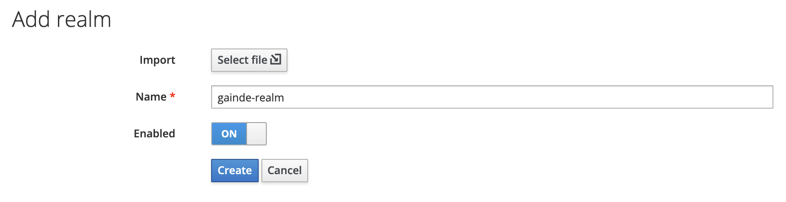
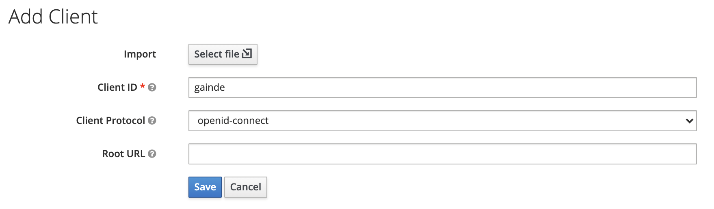
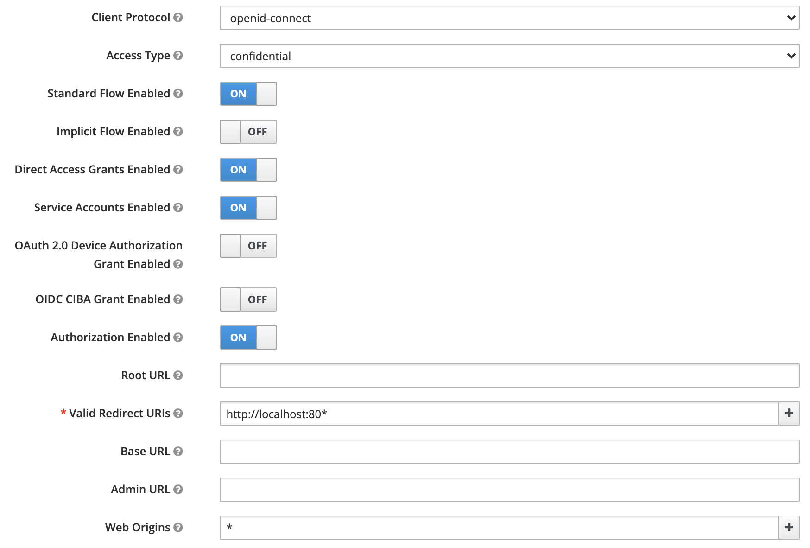
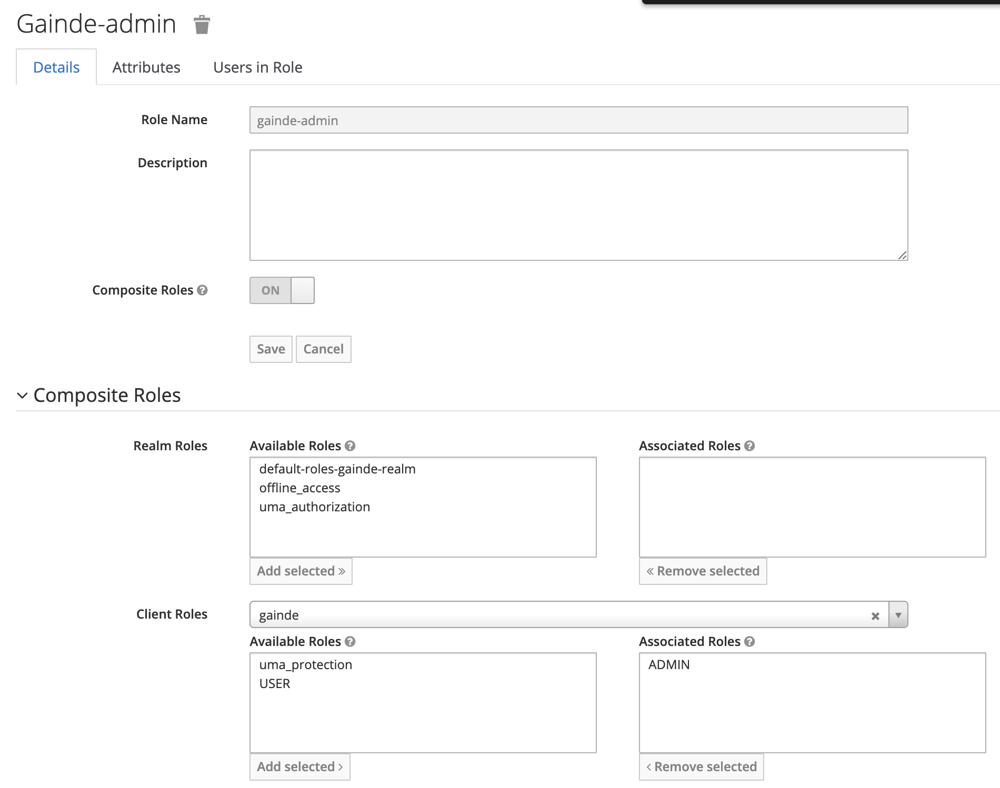
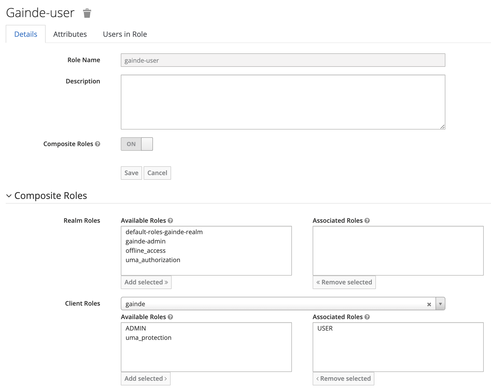
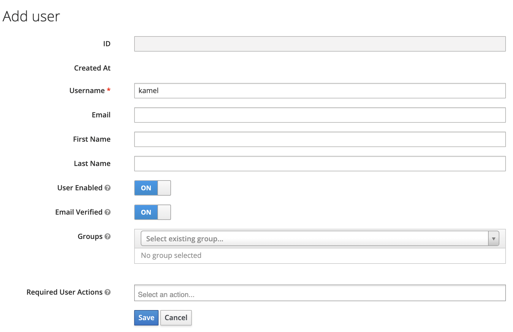
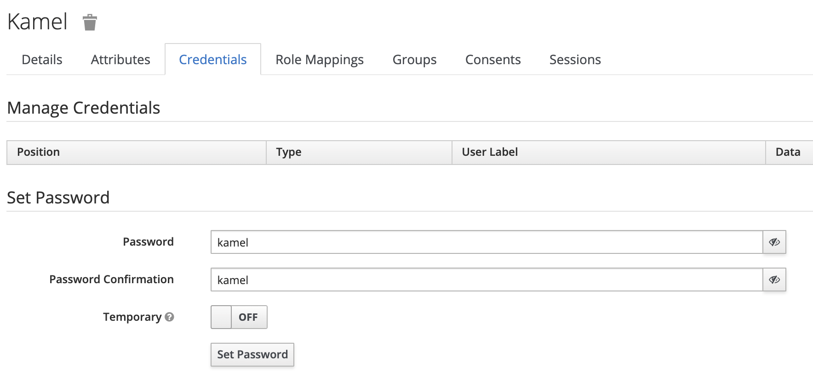
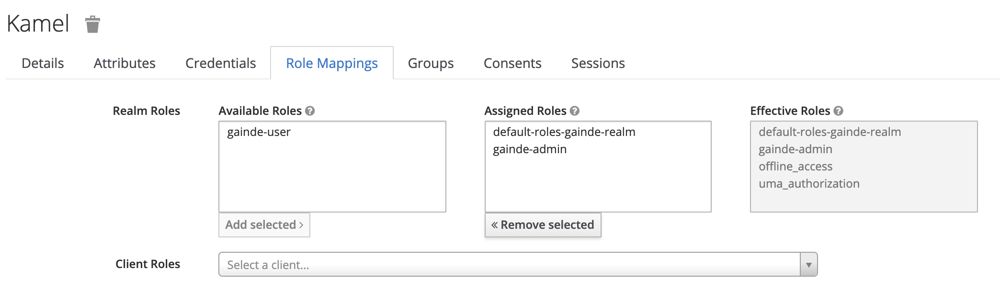
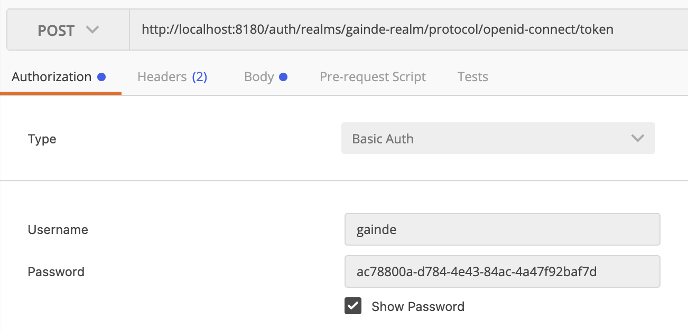
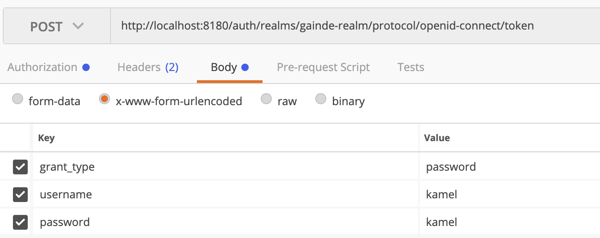

# LAB 9 : Sécurisation de notre application

## Objectif

Il s'agit de sécuriser le système pour autoriser uniquement les requetes clientes possédant un token valide.
Pour cela nous mettrons en place un serveur d'identité opensource Keycloak qui va garder les login et mot de passes de tous les utilisateurs du système.
Keycloak permet aussi de générer les token à la base des informations envoyés par les clients (login /pass)
Notre point d'entrée du système est l'application gateway-servicd. On se limitera dans cet atelier de sécuriser uniquement la gateway-service.
De préference tous les modules applicatifs doivent etre sécurisés.

## les points à voir

+ Spring security pour sécuriser la gateway

## Installation et mise en place de keycloak

Dézipper keycloak dans votre dossier de travail
Lancer keycloak avec la commande suivante

```
./standalone.sh -Djboss.socket.binding.port-offset=100
```

sous windows la commande est la suivante

```
standalone.bat -Djboss.socket.binding.port-offset=100
```


Par defaut le serveur web de keycloak ecoute sur le port 8080. Nous allons modifier le port en utilisant le port offset de la commande precédante.

## Accès à la console d'administration et création du compte administrateur

Voici l'adresse de la console admin

```
http://localhost:8180/auth/
```

créer un utilisateur admin pour keycloak avec le mot de passe admin.

Cliquer sur Administration console

et saisir admin / admin

## Configuration de keycloak

* Ajouter un nouveau realm gainde-realm dans keycloak



* Cliquer sur Client dans le menu de gauche

Et appuyer sur le bouton "create"



* Au niveau de la configuration du client gainde
```
Access Type: Confidential
Service Accounts Enabled: On
Authorization Enabled: On
Valid Redirect URLs: http://localhost:80*
Web Origins: *
```



Cliquer sur "save"

* Au niveau du l'onglet : role

Appuyer sur "Add Role"
et ajouter les deux roles

```
USER
ADMIN
```
* Au niveau de l'onglet "Credentials"

Copier le client secret dans vos notes
```
008ae888-eb53-4f47-acbc-4d6c1a977993
```

* Maintenant il faut créer les Realm-Role ça permet d'associer les utilisateurs aux roles.

appuyer sur Role dans le menu de gauche.

ensuite Add Role.
et saisir : gainde-admin



* Refaire les memes etapes pour gainder-user role et le mapper au client role USER



* Configuration des utilisateurs de gainde.

Dans le menu de gauche, appuyer sur : Users

ensuite "Add user"



et cliquer sur save

* Cliquer sur l'onglet credentials

saisir le mot de passe : kamel et desactiver "temporary"



* Cliquer sur l'onglet role mapping

et rajouter gainde-admin dans "selected roles"




* Dans le menu de gauche : appuyer sur "Realm settings".

Au niveau de l'attribut endpoint, clique sur "OpenID endpoint configuration".

copier le token_endpoint :

```
http://localhost:8180/auth/realms/gainde-realm/protocol/openid-connect/token
```

* Decompiler le token dans jwt.io (optionnel)

* Maintenant on simule un utilisateur qui veut un accès token

POST http://localhost:8180/auth/realms/gainde-realm/protocol/openid-connect/token

```
Basic auth
Username : gainde
Password : ac78800a-d784-4e43-84ac-4a47f92baf7d
```

```
dans body saisir
grant_type : password
username : kamel
password : kamel
```

A l'aide de POSTMAN faire cela






## Mise en place de la sécurité au niveau de la gateway

* Dans le pom.xml du module **gateway-service** ajouter les dependances suivantes

```
<dependency>
  <groupId>org.springframework.boot</groupId>
  <artifactId>spring-boot-starter-security</artifactId>
</dependency>
<dependency>
  <groupId>org.springframework.boot</groupId>
  <artifactId>spring-boot-starter-oauth2-client</artifactId>
</dependency>
<dependency>
  <groupId>org.springframework.boot</groupId>
  <artifactId>spring-boot-starter-oauth2-resource-server</artifactId>
</dependency>
```

* Créer un package **config** dans le module gateway-service dans lequel vous mettez la classe suivante

```
package com.jc.gainde.gatewayservice.config;

import org.springframework.context.annotation.Bean;
import org.springframework.context.annotation.Configuration;
import org.springframework.security.config.annotation.web.reactive.EnableWebFluxSecurity;
import org.springframework.security.config.web.server.ServerHttpSecurity;
import org.springframework.security.web.server.SecurityWebFilterChain;

@Configuration
@EnableWebFluxSecurity
public class SecurityConfig {

    @Bean
    SecurityWebFilterChain springSecurityFilterChain(ServerHttpSecurity http) throws Exception {

        http
                .csrf().disable()
                .authorizeExchange()
                .pathMatchers("/actuator/**").permitAll()
                .pathMatchers("/configuration/ui").permitAll()
                .pathMatchers("/configuration/security").permitAll()
                .pathMatchers("/webjars/**").permitAll()

                .anyExchange()
                .authenticated()
                .and()
                .oauth2ResourceServer()
                .jwt();
        return http.build();
    }
}   
```

* Dans gateway-service-dev.properties en local sur votre machine rajouter la proriété spring securité qui pointe vers votre serveur d'authentification

```
# spring cloud security
spring.security.oauth2.resourceserver.jwt.issuer-uri=http://localhost:8180/auth/realms/gainde-realm
```

## Recompilation du projet et tests

```
mvn clean install -DskipTests
mvn spring-boot:run
```

Faites quelques tests d'appels vers la gateway avec ou sans token et voir le résultat.


## Pour résumer

+ Securisation de la gateway avec spring security
+ mise en place d'un serveur idp keycloak
